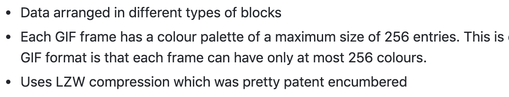
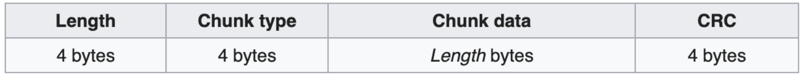
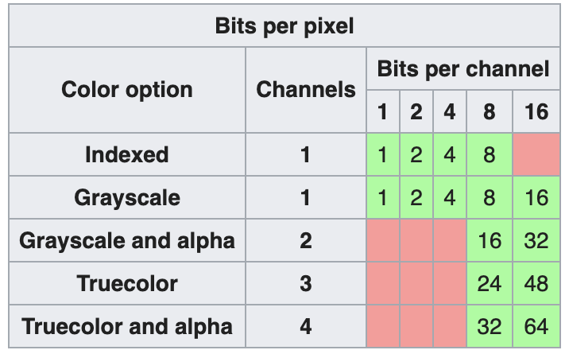
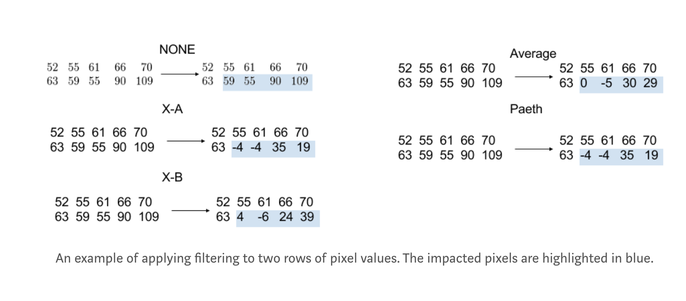
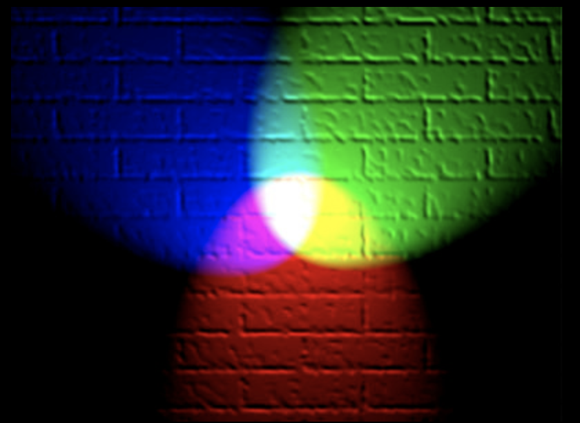
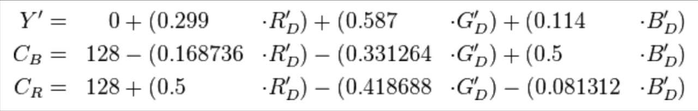
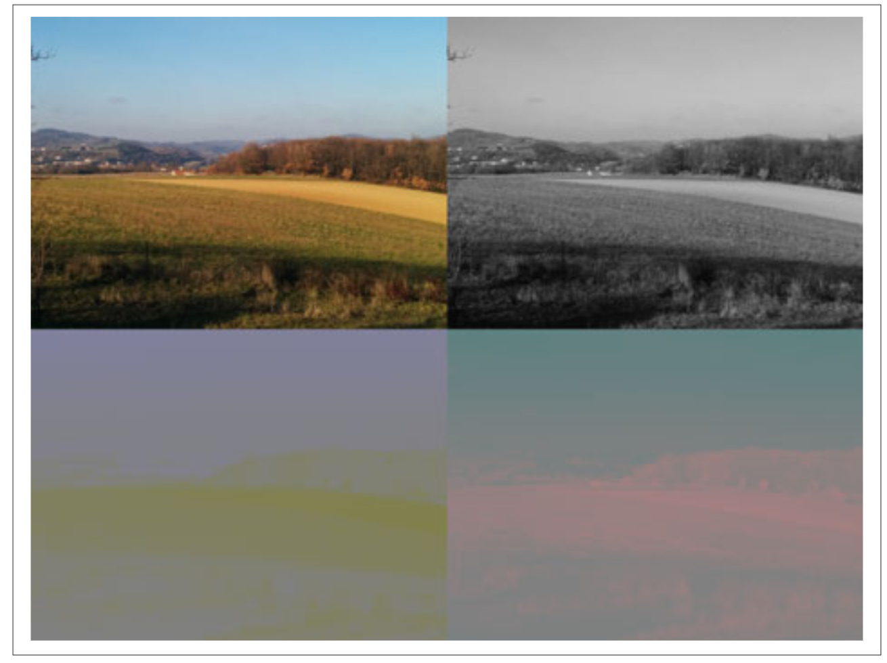

# Advanced Image Optimisation

## Workshop Overview

## Why images are important for performance

## Overview of different image formats
### GIF
- The oldest image format, created in 1987!
- Supports animation and transparency
- Data arranged in different types of blocks
- Each GIF frame has a colour palette of a maximum size of 256 entries. This is one of the biggest limitations of the GIF format is that each frame can have only at most 256 colours. 
- Uses [LZW compression](http://matthewflickinger.com/lab/whatsinagif/lzw_image_data.asp) which was pretty patent encumbered
- Interlace option to allow a rough version of an image to be displayed before the full image has been transmitted

Read more - [http://matthewflickinger.com/lab/whatsinagif/bits\_and\_bytes.asp](http://matthewflickinger.com/lab/whatsinagif/bits_and_bytes.asp)

### PNG
- Problems with GIF lead to creation of PNG
- Portable Networks Graphics or PNG is not GIF
- Lossless image format
- Supports transparency but not animation 
- Another (dead) format called MNG was created for animation, later APNG
#### PNG Chunks
##### Critical and ancillary chunks

The case of the first letter indicates whether the chunk is critical or not. If the first letter is uppercase, the chunk is critical; if not, the chunk is ancillary.
Ancillary chunks can be safely ignored. A decoder must be able to interpret critical chunks to read and render a PNG file.

- IHDR must be the first chunk; it contains (in this order) the image's width (4 bytes), height (4 bytes), bit depth (1 byte), colour type (1 byte), compression method (1 byte), filter method (1 byte), and interlace method (1 byte) (13 data bytes total).
- PLTE contains the palette; list of colours.
- IDAT contains the image, which may be split among multiple IDAT chunks.
- IEND marks the image end.

##### Types of PNG 

##### PNG compression
###### Prediction / Filtering

Read more [here](https://medium.com/@duhroach/how-png-works-f1174e3cc7b7)
###### Deflate
- descendant of LZ77 algorithm
- combines LZ77 with Huffman encoding
### Color spaces
Colour spaces are a way to represent colour with numeric values. 
Additive colour spaces work from black and adding primary colours to it. The RGB colour space works like this. Additive colour spaces are used by surfaces which emit their own light like computer screens. 

Subtractive colour spaces are used in printing etc, where they reflect light. It starts off from a white background and use different pigments to prevent light from reflecting off the surface. Example, CMYK colour space. 
### YCbCr
This colour space can be derived from the RGB colour space using the following formula. 

The main advantage of using the YCbCr model is that the brightness channel is separated out. The human eye is more sensitive to changes in brightness than changes in colour. Separating this channel out means that the colour channels can be more aggressively optimised compared to the brightness channels without looking very different visually. 

### JPEG
- Has two parts - the container and the payload
- Two major types of containers used - JPEG File Interchange Format (JFIF) and  Exchangeable Image File Format (EXIF). 
- EXIF container format is more advanced and can contain metadata information about the picture

## Exercise 1 - Generational loss
## Exercise 2 - Chroma subsampling
## Exercise 3 - EXIF tool

Read more [here](https://parametric.press/issue-01/unraveling-the-jpeg/) (Unravelling the JPEG)
