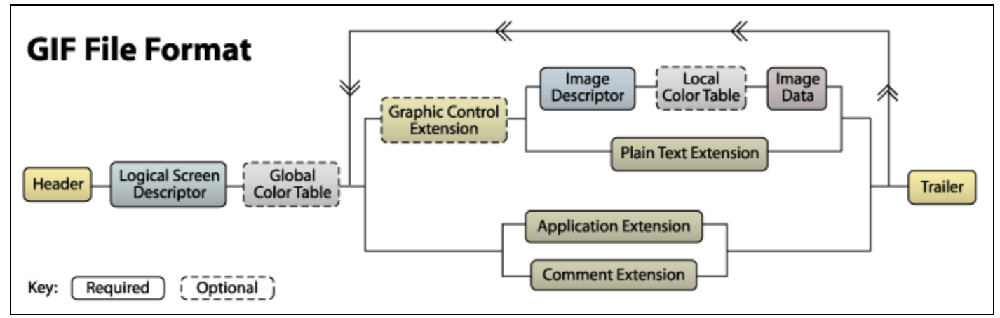

# Advanced Image Optimisation
## Tools required for the workshop
- Imagemagick
- ffmpeg
- git
- Node.js v10
- RUST
- Clone [https://github.com/inian/jsconf-workshop](https://github.com/inian/jsconf-workshop) 
(Or)
Clone the docker image   
> docker pull everconfusedguy/jsconf-workshop:v1  
> docker run -v /path/to/a/local/folder:/vol -it everconfusedguy/jsconf-workshop:v1 /bin/bash  
> cd /home/jsconf/jsconf-workshop  
> git pull  
## Why images are important for performance

## Overview of different image formats
### GIF
- The oldest image format, created in 1987!
- Supports animation and transparency
- Data arranged in different types of blocks
- Each GIF frame has a colour palette of a maximum size of 256 entries. This is one of the biggest limitations of the GIF format is that each frame can have only at most 256 colours. 
- Uses [LZW compression](http://matthewflickinger.com/lab/whatsinagif/lzw_image_data.asp) which was pretty patent encumbered
- Interlace option to allow a rough version of an image to be displayed before the full image has been transmitted

[http://matthewflickinger.com/lab/whatsinagif/bits\_and\_bytes.asp](http://matthewflickinger.com/lab/whatsinagif/bits_and_bytes.asp)

### PNG
- Problems with GIF lead to creation of PNG
- Portable Networks Graphics or PNG is not GIF
- Lossless image format
- Supports transparency but not animation 
- Another (dead) format called MNG was created for animation, later APNG
#### PNG Chunks
##### Critical and ancillary chunks

The case of the first letter indicates whether the chunk is critical or not. If the first letter is uppercase, the chunk is critical; if not, the chunk is ancillary.
Ancillary chunks can be safely ignored. A decoder must be able to interpret critical chunks to read and render a PNG file.

- IHDR must be the first chunk; it contains (in this order) the image's width (4 bytes), height (4 bytes), bit depth (1 byte), colour type (1 byte), compression method (1 byte), filter method (1 byte), and interlace method (1 byte) (13 data bytes total).
- PLTE contains the palette; list of colours.
- IDAT contains the image, which may be split among multiple IDAT chunks.
- IEND marks the image end.

##### Types of PNG 

##### PNG compression
###### Prediction / Filtering

[https://medium.com/@duhroach/how-png-works-f1174e3cc7b7](https://medium.com/@duhroach/how-png-works-f1174e3cc7b7)
###### Deflate
- descendant of LZ77 algorithm
- combines LZ77 with Huffman encoding
### Color spaces
Colour spaces are a way to represent colour with numeric values. 
Additive colour spaces work from black and adding primary colours to it. The RGB colour space works like this. Additive colour spaces are used by surfaces which emit their own light like computer screens. 

Subtractive colour spaces are used in printing etc, where they reflect light. It starts off from a white background and use different pigments to prevent light from reflecting off the surface. Example, CMYK colour space. 
### YCbCr
This colour space can be derived from the RGB colour space using the following formula. 

The main advantage of using the YCbCr model is that the brightness channel is separated out. The human eye is more sensitive to changes in brightness than changes in colour. Separating this channel out means that the colour channels can be more aggressively optimised compared to the brightness channels without looking very different visually. 

### JPEG
- Has two parts - the container and the payload
- Two major types of containers used - JPEG File Interchange Format (JFIF) and  Exchangeable Image File Format (EXIF). 
- EXIF container format is more advanced and can contain metadata information about the picture
- [https://parametric.press/issue-01/unraveling-the-jpeg/](https://parametric.press/issue-01/unraveling-the-jpeg/)
- [http://www.jezzamon.com/fourier/index.html](http://www.jezzamon.com/fourier/index.html)

### WebP and other browser specific image formats
## Exercise 1 - Generational loss
[https://petapixel.com/2016/04/06/happens-resave-image/](https://petapixel.com/2016/04/06/happens-resave-image/)
[https://photo.stackexchange.com/questions/99604/what-factors-cause-or-prevent-generational-loss-when-jpegs-are-recompressed-mu](https://photo.stackexchange.com/questions/99604/what-factors-cause-or-prevent-generational-loss-when-jpegs-are-recompressed-mu)
- JPEG is a lossy format
- if you save JPEG at 80 and then at 90, the image will look worse even though the quality is higher
- how to avoid generational loss
- taking smaller images seem to work better for this experiment
- if you use a constant quality instead of a random quality, there will be convergence after sometime
## Exercise 2 - Chroma subsampling
- [https://calendar.perfplanet.com/2015/why-arent-your-images-using-chroma-subsampling/](https://calendar.perfplanet.com/2015/why-arent-your-images-using-chroma-subsampling/)
- [https://en.wikipedia.org/wiki/Chroma\_subsampling](https://en.wikipedia.org/wiki/Chroma_subsampling)
- J:a:b
-  a represents the number of colors used from the first row. 
- b represents the number of new colors used in the second row.
## Exercise 3 - Progressive JPEGs
- Install Mozjpeg ([https://github.com/mozilla/mozjpeg/blob/master/BUILDING.md](https://github.com/mozilla/mozjpeg/blob/master/BUILDING.md))
- convert -strip -interlace Plane input.jpg output.jpg
Advantages
- Progressive JPEGs are usually smaller
- Better UX (mostly everyone agrees on this)
Disadvantages
- Higher decode time
- Smaller images may become larger when converted to progressive JPEGs
## Exercise 4 - EXIF tool
- Download images from different social networks and see what metadata they have if any
- [https://dexecure.com/blog/impact-of-metadata-on-image-performance/](https://dexecure.com/blog/impact-of-metadata-on-image-performance/)
- [http://exif.regex.info/exif.cgi](http://exif.regex.info/exif.cgi)
## Client Hints
- sent for same origin domains
- sent for cross-origin domains only on android mobile devices (emulation doesn’t work)
- sent only https or localhost
- [https://developers.google.com/web/updates/2015/09/automating-resource-selection-with-client-hints](https://developers.google.com/web/updates/2015/09/automating-resource-selection-with-client-hints)
- privacy violation? [https://github.com/httpwg/http-extensions/issues/767](https://github.com/httpwg/http-extensions/issues/767)
## Image decoding
- [https://dexecure.com/blog/image-decoding/](https://dexecure.com/blog/image-decoding/)
## DSSIM
- Quality is not what you think it is
- [https://github.com/kornelski/dssim](https://github.com/kornelski/dssim)
- Butteraugli
## Network based image optimisation
- [https://dexecure.com/blog/network-based-asset-optimization/](https://dexecure.com/blog/network-based-asset-optimization/)
## LQIP
- [https://github.com/fogleman/primitive](https://github.com/fogleman/primitive)
- [https://github.com/technopagan/sqip](https://github.com/technopagan/sqip)
- [https://github.com/zouhir/lqip](https://github.com/zouhir/lqip)
- https://coldstorage.dexecure.net/media/cms/banners/homepage\_banner\_-\_moet\_chandon\_june\_2019-20190603155329.jpg?format=lqip
## Video in Safari exercise
### Advantages
- Videos are much more efficient formats than GIFs in terms of size and decode speeds
- Very less change to markup required to take advantage of this
### Disadvantages
- Videos are not caught by the lookahead scanner
- Newer image formats like AV1 which are based on video frames are coming to browsers soon, making this only as a stopgap solution
## Lazy Loading in website
- [https://developers.google.com/web/fundamentals/performance/lazy-loading-guidance/images-and-video/](https://developers.google.com/web/fundamentals/performance/lazy-loading-guidance/images-and-video/)
- [https://addyosmani.com/blog/lazy-loading/](https://addyosmani.com/blog/lazy-loading/)
## Dexecure Demo
- [https://dexecure.com/products/](https://dexecure.com/products/)
## Challenges in building an image optimisation pipeline
- Our previous architecture [https://www.youtube.com/watch?v=dD71X0lXUqI](https://www.youtube.com/watch?v=dD71X0lXUqI)
- Scalability: Image processing in pretty compute intensive
	- Spot instances
	- Asynchronous architecture
- Bursty workloads 
	- Traffic can spike 5x during a new deploy for example 
- The web is messy
	- images without correct headers (like s3)
	- images with wrong headers
	- Polyglot files
- Working with different caching headers
- Working with different CDNs
## Bonus activities
- Responsive images 
	- [https://www.smashingmagazine.com/2014/05/responsive-images-done-right-guide-picture-srcset/](https://www.smashingmagazine.com/2014/05/responsive-images-done-right-guide-picture-srcset/)
